# รายงานการพัฒนาโปรแกรมคอมพิวเตอร์
## โครงงาน KKU SportPass: ระบบจองสนามและสิ่งอำนวยความสะดวกด้านกีฬา มหาวิทยาลัยขอนแก่น
### (KKU SportPass: Khon Kaen University Sports Facility Reservation and Management System)

---

**รายวิชา:** CP321007 การคิดเชิงออกแบบสำหรับเทคโนโลยีสารสนเทศ / CP321002 การพัฒนาโปรแกรมคอมพิวเตอร์  
**ภาคเรียนที่ 1 ปีการศึกษา 2569**  
**สาขาวิชาวิทยาการคอมพิวเตอร์ วิทยาลัยการคอมพิวเตอร์ มหาวิทยาลัยขอนแก่น**  

**ผู้จัดทำโครงงาน (สมาชิกกลุ่ม):**
1. 69xxxxxx-x นาย/นางสาว [ชื่อ-นามสกุล สมาชิกคนที่ 1]
2. 69xxxxxx-x นาย/นางสาว [ชื่อ-นามสกุล สมาชิกคนที่ 2]
3. 69xxxxxx-x นาย/นางสาว [ชื่อ-นามสกุล สมาชิกคนที่ 3]
4. 69xxxxxx-x นาย/นางสาว [ชื่อ-นามสกุล สมาชิกคนที่ 4]
5. 69xxxxxx-x นาย/นางสาว [ชื่อ-นามสกุล สมาชิกคนที่ 5]

---

## สารบัญ

| ลำดับ | หัวข้อเรื่อง | หน้า |
| :---: | :--- | :---: |
| **1** | **บทนำ** | 1 |
| **2** | **วัตถุประสงค์ของการพัฒนาโปรแกรม** | 2 |
| **3** | **แนวคิดและการออกแบบของโปรแกรมเป็น Flow Chart พร้อมคำอธิบายอย่างละเอียด** | 3 |
| | 3.1 ภาพรวมสถาปัตยกรรมและวงจรชีวิตระบบ (System Overview & Lifecycle Flowchart) | 3 |
| | 3.2 กระบวนการรักษาความปลอดภัยและการตรวจสอบคำขอ (Security & Request Validation Pipeline) | 5 |
| | 3.3 กระบวนการจองสนามและกลไกป้องกันการชนกันของเวลา (Booking & Anti-Conflict Engine) | 7 |
| | 3.4 กระบวนการชำระเงิน ตรวจสอบสลิป และการอนุมัติ (Payment, Slip Verification & Approval) | 10 |
| | 3.5 กลไกการเช็คอินเข้าสนามด้วย QR Code ประจำสนาม ร่วมกับ GPS และระบบ Login (Court QR, GPS & User Check-in) | 12 |
| | 3.6 กลไกการประมวลผลงานเบื้องหลังอัตโนมัติ (Automated Scheduled Cron & Waitlist Promotion Engine) | 14 |
| **4** | **การออกแบบโปรแกรม** | 16 |
| | 4.1 ออกแบบการพัฒนาโปรแกรม (System Architecture & Database Design) | 16 |
| | 4.2 ออกแบบรูปแบบการใช้งานโปรแกรม (UI/UX & User Interaction Design) | 22 |
| **5** | **เครื่องมือที่ใช้พัฒนาโปรแกรม** | 25 |
| **6** | **ความสามารถและวิธีใช้งานโปรแกรม** | 27 |
| | 6.1 สรุปฟังก์ชันความสามารถของระบบ | 27 |
| | 6.2 คู่มือขั้นตอนการใช้งานสำหรับผู้ใช้ทั่วไป (User Guide) | 29 |
| | 6.3 คู่มือขั้นตอนการใช้งานสำหรับเจ้าหน้าที่และผู้ดูแลระบบ (Admin Guide) | 31 |
| **7** | **การทดสอบโปรแกรม** | 34 |
| | 7.1 การออกแบบชุดการทดสอบระบบ (Test Suites & Test Matrix) | 34 |
| | 7.2 การทดสอบกรณีข้อผิดพลาด (Error Handling & Edge Cases) | 36 |
| | 7.3 ตารางบันทึกผลการทดสอบ ข้อผิดพลาด และแนวทางการแก้ไข | 38 |
| **8** | **สรุปผลการพัฒนาโครงงาน** | 40 |

---

## 1. บทนำ

*(ย่อหน้าที่ 1: สาเหตุและที่มาที่ต้องพัฒนาโปรแกรมนี้ขึ้นมา)*  
มหาวิทยาลัยขอนแก่นเป็นสถาบันการศึกษาขนาดใหญ่ที่มีนักศึกษา คณาจารย์ และบุคลากรรวมกันกว่า 40,000 คน โดยมีสิ่งอำนวยความสะดวกด้านการกีฬาและสุขภาพกระจายอยู่ตามจุดต่าง ๆ ทั่วมหาวิทยาลัย เช่น อาคารพลศึกษา (Gymnasium) สนามกีฬากลาง สนามเทนนิส สระว่ายน้ำ และสนามแบดมินตัน รวมกว่า 21 สนาม ใน 17 ชนิดกีฬา อย่างไรก็ตาม ในอดีตการเข้าใช้บริการสนามกีฬายังคงพึ่งพาระบบการจองแบบเดิมที่ผู้ใช้ต้องเดินทางไปยังสถานที่จริงเพื่อตรวจสอบตารางเวลาว่างและติดต่อเจ้าหน้าที่ หรือใช้ระบบเอกสารกระดาษ ซึ่งก่อให้เกิดปัญหาความไม่สะดวก การเสียเวลาเดินทาง การเกิดข้อพิพาทเรื่องการจองช่วงเวลาทับซ้อนกัน (Double Booking) การขาดความโปร่งใสในการจัดสรรคิว ตลอดจนเจ้าหน้าที่สนามไม่สามารถติดตามสถิติการใช้งานหรือตรวจสอบความถูกต้องของผู้เข้าใช้งานได้อย่างมีประสิทธิภาพ จึงมีความจำเป็นเร่งด่วนในการพัฒนาระบบเทคโนโลยีสารสนเทศเพื่อยกระดับการบริหารจัดการสนามกีฬาของมหาวิทยาลัยให้ทันสมัย มีประสิทธิภาพ และโปร่งใส

*(ย่อหน้าที่ 2: อธิบายตัวโปรแกรมพอสังเขป ให้เห็นภาพรวมของระบบ)*  
ระบบ **KKU SportPass** เป็นเว็บแอปพลิเคชันสำหรับการจองและบริหารจัดการสนามกีฬาของมหาวิทยาลัยขอนแก่นแบบครบวงจร (Full-Stack Cloud-Native Web Application) ที่ถูกออกแบบมาเพื่อรองรับการใช้งานผ่านอุปกรณ์คอมพิวเตอร์ แท็บเล็ต และสมาร์ตโฟน (Responsive Web Design) ภายในระบบประกอบด้วยฟังก์ชันการค้นหาและกรองสนามตามชนิดกีฬาและอาคารสถานที่ ระบบตรวจสอบตารางเวลาว่างแบบเรียลไทม์ (Live Slot Availability) ระบบป้องกันการจองซ้อน (Conflict Prevention Engine) ระบบคิวรออัตโนมัติ (Automated Waitlist) ระบบชำระเงินและแจ้งสลิป (Payment & Slip Verification) **ระบบเช็คอินเข้าใช้งานสนามด้วยการสแกน QR Code ประจำสนาม (Court QR Code) ร่วมกับระบบระบุตำแหน่งพิกัดดาวเทียม (GPS Geofencing) และการเชื่อมโยงกับบัญชีผู้ใช้ที่ทำการจองผ่านระบบ Login โดยตรง** ป้องกันการสวมสิทธิ์และการเช็คอินทิพย์ได้อย่างสมบูรณ์แบบ ตลอดจนแดชบอร์ดบริหารจัดการสำหรับเจ้าหน้าที่และผู้บริหารที่มีการแบ่งสิทธิ์การเข้าถึงอย่างรัดกุม 5 ระดับ (Super Admin, Admin, Staff, Viewer, User) ระบบบันทึกประวัติการกระทำ (Audit Logging) และระบบวิเคราะห์ข้อมูลสถิติการใช้งานในรูปแบบแผนภาพความหนาแน่น (Utilization Heatmap)

*(ย่อหน้าที่ 3: ประโยชน์ที่ผู้ใช้งานจะได้รับจากการพัฒนาโปรแกรม)*  
การพัฒนาโปรแกรม KKU SportPass ก่อให้เกิดประโยชน์อย่างเป็นรูปธรรมแก่ทุกภาคส่วน โดยในส่วนของ**ผู้ใช้งานทั่วไป (นักศึกษาและบุคลากร)** จะได้รับความสะดวกรวดเร็วในการตรวจสอบสถานะสนามและทำการจองได้ตลอด 24 ชั่วโมงจากทุกสถานที่ ลดเวลาและค่าใช้จ่ายในการเดินทาง สามารถวางแผนการออกกำลังกายล่วงหน้าได้อย่างมั่นใจ เมื่อถึงเวลาใช้งานสามารถเดินทางไปที่สนามแล้วใช้สมาร์ตโฟนสแกนป้าย QR Code ประจำสนามเพื่อเช็คอินยืนยันตัวตนได้ทันทีอย่างสะดวกปลอดภัย ในส่วนของ**เจ้าหน้าที่สนามและผู้ดูแลระบบ** จะได้รับประโยชน์จากการลดภาระงานเอกสาร ลดความขัดแย้งจากปัญหาคิวซ้ำซ้อน ไม่จำเป็นต้องมีเจ้าหน้าที่คอยยืนเฝ้าตรวจตั๋วหน้าสนามตลอดเวลาเนื่องจากมีระบบตรวจสอบพิกัด GPS อัตโนมัติ และในส่วนของ**ผู้บริหารมหาวิทยาลัย** ระบบนี้ช่วยสร้างความโปร่งใส ตรวจสอบย้อนหลังได้ทุกขั้นตอนผ่าน Audit Log พร้อมทั้งให้ข้อมูลเชิงสถิติที่สะท้อนถึงอัตราการใช้งานสนามกีฬาแต่ละประเภทอย่างแท้จริง ซึ่งเป็นประโยชน์อย่างยิ่งต่อการวางแผนจัดสรรงบประมาณ การบำรุงรักษา และการพัฒนาโครงสร้างพื้นฐานด้านกีฬาของมหาวิทยาลัยขอนแก่นในอนาคต

---

## 2. วัตถุประสงค์ของการพัฒนาโปรแกรม

2.1 เพื่อพัฒนาเว็บแอปพลิเคชันสำหรับการจองสนามกีฬาและสิ่งอำนวยความสะดวกของมหาวิทยาลัยขอนแก่นแบบออนไลน์ที่สามารถใช้งานได้ตลอด 24 ชั่วโมง  
2.2 เพื่อสร้างระบบตรวจสอบและป้องกันการจองช่วงเวลาซ้ำซ้อน (Anti-Double Booking & Slot Conflict Prevention Engine) ที่มีความถูกต้อง แม่นยำ และเป็นไปตามเงื่อนไขของแต่ละสนาม  
2.3 เพื่อพัฒนาระบบตรวจสอบการเข้าใช้งานสนามด้วยการสแกนรหัส QR ประจำสนาม ร่วมกับพิกัดดาวเทียม (Court QR Code & GPS Geofencing Check-in System) ที่เชื่อมโยงกับบัญชีผู้ใช้ที่ทำการจองผ่านระบบ Login ป้องกันการสวมสิทธิ์และการเช็คอินนอกสถานที่ได้อย่างมีประสิทธิภาพสูงสุด  
2.4 เพื่อสร้างระบบควบคุมสิทธิ์และบริหารจัดการหลังบ้าน (Role-Based Access Control - RBAC) 5 ระดับ สำหรับเจ้าหน้าที่และผู้บริหารในการอนุมัติ ติดตาม และจัดการข้อมูลสนามกีฬาอย่างเป็นระบบ  
2.5 เพื่อเสริมสร้างมาตรฐานความปลอดภัยของข้อมูลและระบบสารสนเทศตามหลักสากล ทั้งการป้องกัน CSRF, XSS, Rate Limiting, Session Fixation และการบันทึกประวัติการกระทำ (Audit Logging)

---

## 3. แนวคิดและการออกแบบของโปรแกรมเป็น Flow Chart พร้อมคำอธิบายอย่างละเอียด

ในการพัฒนาระบบ **KKU SportPass** คณะผู้พัฒนาได้นำหลักการคิดเชิงออกแบบ (Design Thinking) และสถาปัตยกรรมซอฟต์แวร์สมัยใหม่มาประยุกต์ใช้ เพื่อแก้ไขปัญหาความซับซ้อนของการบริหารจัดการสนามกีฬา 21 สนาม และ 17 ชนิดกีฬา โดยได้จำแนกแนวคิดและการออกแบบระบบออกเป็นแผนภาพผังงาน (Flow Chart) ทั้งสิ้น 6 ผัง พร้อมคำอธิบายตรรกะการทำงาน (Logic Description) เงื่อนไขการตัดสินใจ (Decision Points) ข้อมูลนำเข้า-ผลลัพธ์ (I/O) และการจัดการข้อผิดพลาด (Exception Handling) ดังนี้:

---

### 3.1 ภาพรวมสถาปัตยกรรมและวงจรชีวิตระบบ (System Overview & Lifecycle Flowchart)

ผังนี้แสดงปฏิสัมพันธ์และการไหลของข้อมูลระหว่าง 3 ภาคส่วนหลัก ได้แก่ **ผู้ใช้งานทั่วไป (User)**, **เจ้าหน้าที่และผู้ดูแลระบบ (Staff/Admin)**, และ **ระบบงานเบื้องหลังอัตโนมัติ (Automated Cron Job)** ที่ทำงานร่วมกันผ่าน Cloud Edge API Gateway และฐานข้อมูลกลาง

<div align="center">
  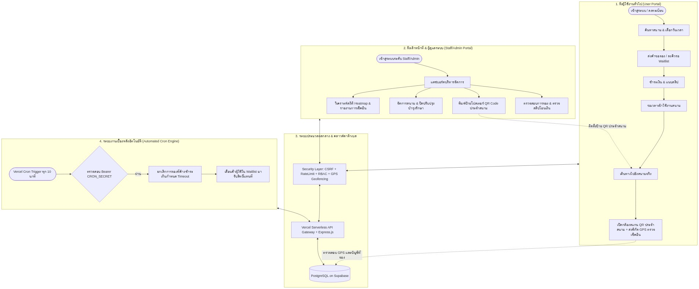
  <p><em>รูปที่ 3.1 แผนภาพวงจรชีวิตและภาพรวมสถาปัตยกรรมระบบ KKU SportPass</em></p>
</div>

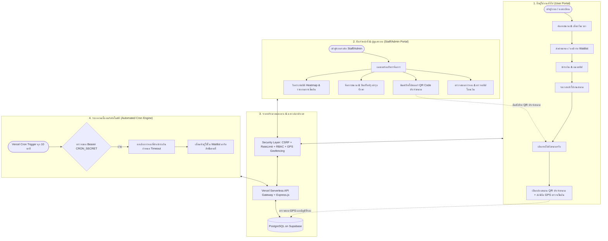

#### คำอธิบายรายละเอียด (Detailed Description)
1. **การเชื่อมประสานแบบเรียลไทม์ (Real-time Synchronization):** ผู้ใช้งานและเจ้าหน้าที่สื่อสารข้อมูลผ่าน API Gateway ตัวเดียวกัน ทำให้สถานะสนามและสล็อตเวลาเป็นข้อมูลปัจจุบันเสมอแบบ Single Source of Truth
2. **การทำงานประสานกัน 3 ทิศทาง:** 
   - ผู้ใช้ทำการจอง -> ข้อมูลส่งไปยังฐานข้อมูล -> เจ้าหน้าที่เปิดตรวจสลิปและกดยืนยัน -> ข้อมูลสถานะเปลี่ยนเป็น `PRE_CONFIRMED`
   - เมื่อถึงวันใช้งาน ผู้ใช้เดินทางไปยังสนามจริง และใช้มือถือเปิดเมนูสแกนเช็คอิน สแกนป้าย QR ประจำสนามพร้อมส่งพิกัด GPS ปัจจุบัน ระบบจะตรวจจับและปรับสถานะเป็น `CHECKED_IN` อัตโนมัติ
   - หากผู้ใช้ไม่ชำระเงินในเวลาที่กำหนด ระบบ Automation จะทำงานโดยอัตโนมัติโดยไม่ต้องพึ่งพาเจ้าหน้าที่ในการตรวจสอบ
3. **ความโปร่งใสและการควบคุม:** ทุกขั้นตอนจะถูกส่งผ่านชั้นความปลอดภัย (Security Layer) และบันทึกลง Audit Log ซึ่งผู้บริหารสามารถเข้ามาสืบค้นย้อนหลังได้ตลอดเวลา

---

### 3.2 กระบวนการรักษาความปลอดภัยและการตรวจสอบคำขอ (Security & Request Validation Pipeline)

ผังนี้แสดงกลไกการคัดกรองและตรวจสอบความปลอดภัยของคำขอ HTTP Request ทุกคำขอก่อนที่จะเข้าถึงชั้น Controller ของระบบ เพื่อป้องกันการโจมตีทางไซเบอร์ตามมาตรฐาน OWASP

<div align="center">
  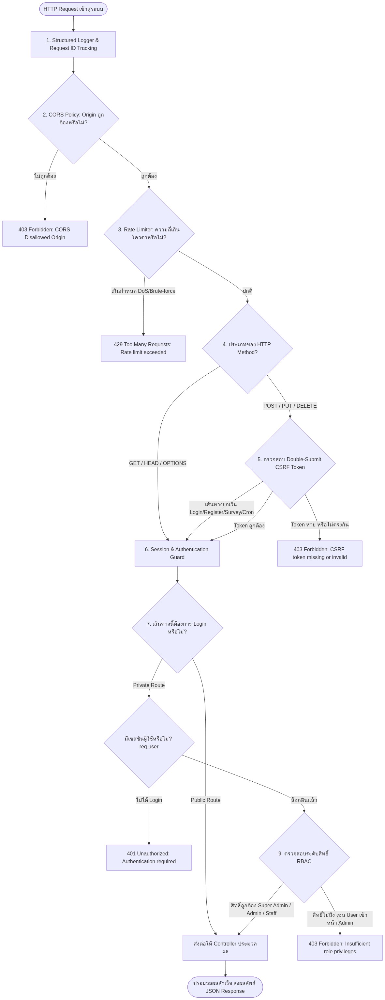
  <p><em>รูปที่ 3.2 กระบวนการตรวจสอบความปลอดภัยของคำขอและเกราะป้องกัน 7 ชั้น</em></p>
</div>

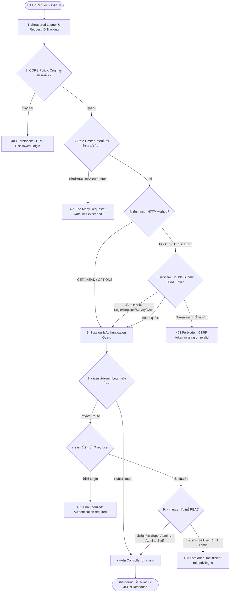

#### คำอธิบายรายละเอียด (Detailed Description)
1. **การกำหนด Request ID และจัดเก็บบันทึก:** ทุก Request ที่เข้ามาจะได้รับ UUID เพื่อการสืบค้น (Correlation ID) และบันทึกผ่าน Structured Logger ในรูปแบบ JSON
2. **การป้องกัน DoS ด้วย Rate Limiting:** จำกัดคำขอตาม IP Address เพื่อป้องกันการสแปมยิงถล่มเซิร์ฟเวอร์ โดยเฉพาะในจุดเสี่ยง เช่น การเข้าสู่ระบบ หรือการส่งคำขอจอง
3. **การป้องกันการปลอมแปลงคำขอข้ามไซต์ (Double-Submit Cookie CSRF Protection):**
   - เมื่อผู้ใช้เข้าสู่ระบบ เบราว์เซอร์จะได้รับคุกกี้ `csrf_token` แบบ `SameSite: Lax`
   - เมื่อผู้ใช้ส่งคำขอแก้ไขข้อมูล (POST/PUT/DELETE) ฟรอนต์เอนด์ (Axios Interceptor) จะอ่านค่าคุกกี้นี้แล้วแนบไปใน Header `X-CSRF-Token`
   - เซิร์ฟเวอร์จะเปรียบเทียบค่าทั้งสอง หากไม่ตรงกันจะปฏิเสธคำขอทันทีด้วยรหัส **403 Forbidden**
4. **การควบคุมสิทธิ์ตามบทบาท (Role-Based Access Control - RBAC):** มีการตรวจสอบลำดับสิทธิ์อย่างเข้มงวดตามลำดับขั้น: `super_admin` > `admin` > `staff` > `viewer` > `user` ป้องกันการเลื่อนขั้นสิทธิ์โดยไม่ได้รับอนุญาต (Privilege Escalation)

---

### 3.3 กระบวนการจองสนามและกลไกป้องกันการชนกันของเวลา (Booking & Anti-Conflict Engine Flowchart)

ผังนี้แสดงหัวใจสำคัญของระบบในการบริหารจัดการสล็อตเวลา การคำนวณราคา และการล็อกข้อมูลเพื่อป้องกันปัญหาการจองเวลาชนกัน (Double Booking) แม้จะมีผู้ใช้หลายคนกดส่งคำขอในเสี้ยววินาทีเดียวกัน

<div align="center">
  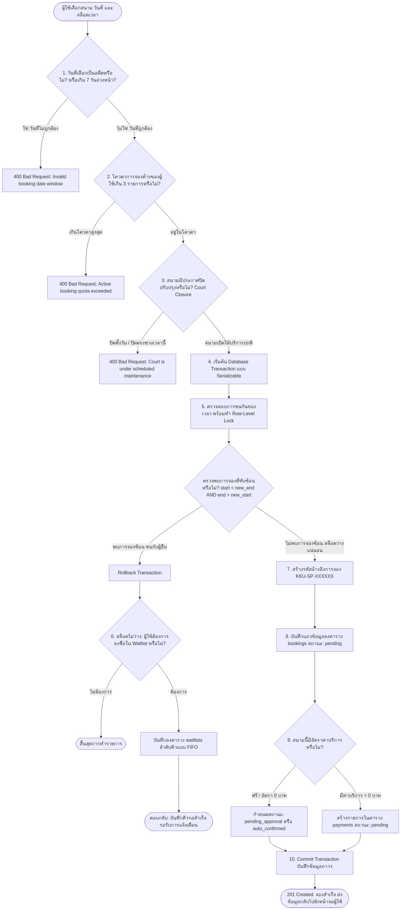
  <p><em>รูปที่ 3.3 แผนผังกลไกการจองสนามและอัลกอริทึมป้องกันการจองซ้อน</em></p>
</div>

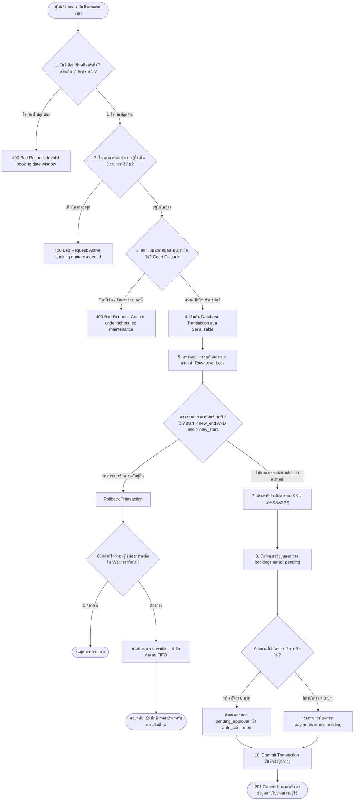

#### คำอธิบายรายละเอียด (Detailed Description)
1. **การตรวจสอบเงื่อนไขเวลาและนโยบาย (Pre-Flight Validation):** 
   - ป้องกันการเลือกวันในอดีต (Past Date Prohibition)
   - ป้องกันการเลือกเวลาที่ล่วงเลยไปแล้วในวันปัจจุบัน
   - จำกัดการจองล่วงหน้าสูงสุดไม่เกิน 7 วันทำการ
   - จำกัดโควตาการจองที่ยังไม่สิ้นสุดไม่เกิน 3 รายการต่อบัญชีผู้ใช้ เพื่อกระจายโอกาสอย่างทั่วถึง
2. **การตรวจสอบการปิดปรับปรุงเฉพาะช่วงเวลา (Partial-Day Closure Overlap Logic):** ระบบรองรับการปิดสนามทั้งแบบทั้งวัน (All-day) และแบบเฉพาะช่วงเวลา (เช่น ปิดทำความสะอาด 13:00 - 15:00 น.) โดยจะตรวจจับการซ้อนทับกันของเวลาตามสูตร `slot_start < closure_end AND slot_end > closure_start`
3. **การป้องกันการแย่งสล็อตพร้อมกัน (Concurrency & Race Condition Prevention):** ใช้คำสั่ง Database Transaction ร่วมกับการล็อกข้อมูล ทำให้หากมีผู้ใช้ 2 คนกดปุ่มจองสล็อตเวลาเดียวกันพร้อมกัน คำขอที่เข้าถึงฐานข้อมูลก่อนเสี้ยววินาทีจะได้รับการ Commit ส่วนคำขอที่สองจะชนกับเงื่อนไข Overlap และถูกตีกลับทันทีอย่างปลอดภัย
4. **ระบบคิวรออัตโนมัติ (Waitlist Fallback):** หากสล็อตเต็ม ผู้ใช้ไม่ต้องคอยรีเฟรชหน้าจอ แต่สามารถกดลงชื่อใน Waitlist ซึ่งระบบจะจัดลำดับคิวตามลำดับเวลาการลงทะเบียน (FIFO Queue)

---

### 3.4 กระบวนการชำระเงิน ตรวจสอบสลิป และการอนุมัติ (Payment, Slip Verification & Approval)

ผังนี้แสดงกระบวนการทางการเงินจำลองเพื่อการศึกษา (Simulated Payment Mode) ตั้งแต่การสร้างยอดชำระ การอัปโหลดหลักฐาน ไปจนถึงขั้นตอนการตรวจสอบโดยเจ้าหน้าที่สนาม

<div align="center">
  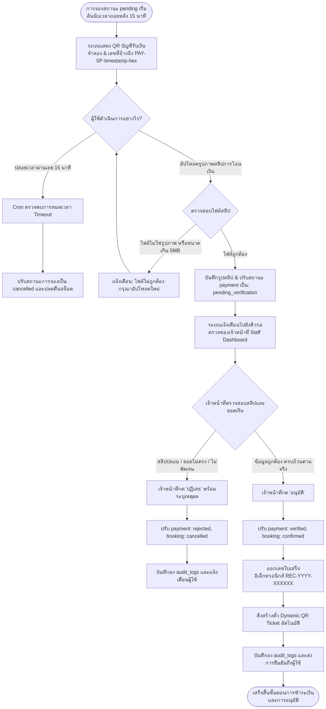
  <p><em>รูปที่ 3.4 ขั้นตอนการชำระเงิน การแนบสลิป และการตรวจสอบอนุมัติโดยเจ้าหน้าที่</em></p>
</div>

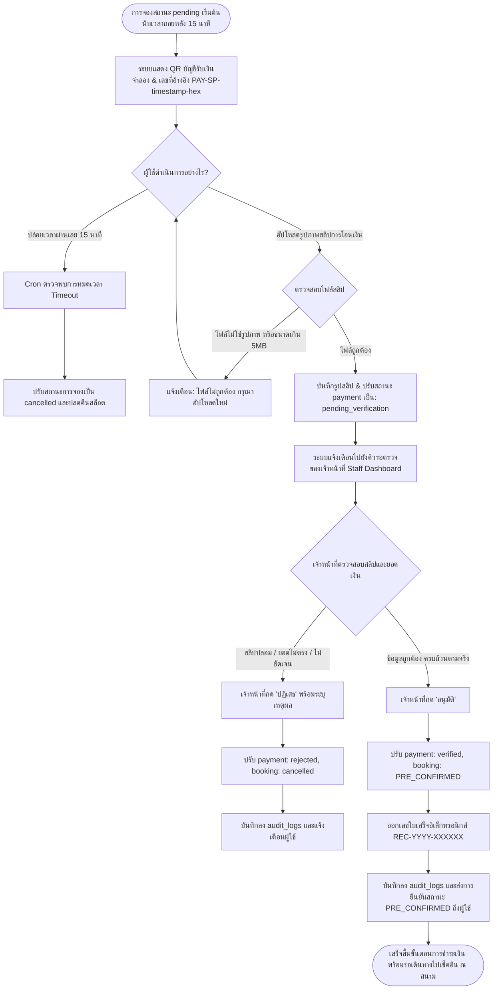

#### คำอธิบายรายละเอียด (Detailed Description)
1. **การระบุสถานะจำลองอย่างโปร่งใส (Explicit Simulated Mode):** เพื่อความถูกต้องตามมาตรฐานการทดสอบระบบ API ทุกเส้นที่เกี่ยวข้องกับการเงินจะส่งคืน `payment_mode: 'simulated'` และบนหน้าจอจะแสดงป้ายกำกับชัดเจนว่าเป็นระบบการศึกษา
2. **การจับเวลาหมดอายุ (Payment Expiration Window):** คำขอจองที่ยังไม่ชำระเงินจะถูกจำกัดเวลาไว้ที่ 15 นาที เพื่อป้องกันปัญหาการกั๊กสล็อตเวลา
3. **การตรวจสอบสลิป 2 ชั้น:** ผู้ใช้อัปโหลดไฟล์หลักฐาน และเจ้าหน้าที่จะเป็นผู้ตรวจสอบความถูกต้องของยอดเงินและเวลาในสลิปผ่านหน้าจอ Admin Bookings พร้อมระบบพรีวิวรูปภาพ
4. **การออกใบเสร็จอิเล็กทรอนิกส์ (Electronic Receipt):** เมื่อผ่านการอนุมัติ ระบบจะปรับสถานะเป็น `PRE_CONFIRMED` และรันหมายเลขใบเสร็จตามฟอร์แมตมาตรฐาน `REC-[ปี ค.ศ.]-[ตัวเลขสุ่ม 6 หลัก]` เพื่อใช้เป็นหลักฐานยืนยันทางบัญชี

---

### 3.5 กลไกการเช็คอินเข้าสนามด้วย QR Code ประจำสนาม ร่วมกับ GPS และระบบ Login (Court QR, GPS & User Check-in)

ผังนี้แสดงกระบวนการเช็คอิน ณ สนามจริง ซึ่งใช้เทคโนโลยีผสมผสาน 3 ส่วนหลัก ได้แก่ **QR Code ประจำสนาม (Court QR)**, **การระบุตำแหน่งดาวเทียม (GPS Geofencing)**, และ **ระบบ Login ที่เชื่อมกับชื่อผู้ใช้ที่จองโดยตรง**

<div align="center">
  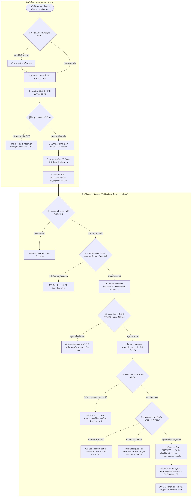
  <p><em>รูปที่ 3.5 ผังการทำงานของระบบเช็คอินด้วย QR Code ประจำสนาม ร่วมกับพิกัด GPS และบัญชีผู้ใช้ที่จอง</em></p>
</div>

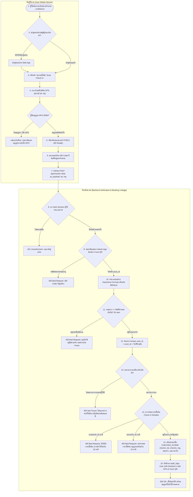

#### คำอธิบายรายละเอียด (Detailed Description)
1. **การเชื่อมโยงกับบัญชีผู้ใช้ที่จองผ่านระบบ Login (Identity Binding):** ผู้ใช้ต้องทำการล็อกอินในระบบเว็บแอปพลิเคชัน เซิร์ฟเวอร์จะตรวจสอบ `req.user.id` และค้นหารายการจองในฐานข้อมูลเฉพาะที่เป็นของผู้ใช้นั้นโดยตรง ทำให้ผู้ใช้อื่นไม่สามารถมาแอบสแกนแทนกันได้
2. **การใช้ QR Code ประจำสนาม (Court QR Code):** สนามแต่ละแห่ง (เช่น สนามแบดมินตัน 1, สนามเทนนิส 2) จะมีแผ่นป้าย QR Code ที่พิมพ์ออกมาติดไว้ที่ประตูทางเข้าสนาม โดย QR Code จะบรรจุรหัสระบุสนาม (`court_id`) ที่เข้ารหัสความปลอดภัยไว้
3. **การตรวจสอบพิกัดภูมิศาสตร์ดาวเทียม (GPS Geofencing):** เมื่อผู้ใช้กดยืนยันสแกน ระบบจะอ่านค่าพิกัด `lat`, `lng` จากชิป GPS ของสมาร์ตโฟน แล้วส่งไปคำนวณระยะห่างทางภูมิศาสตร์ (Haversine Formula) เทียบกับพิกัดจริงของสนาม (`courts.latitude`, `courts.longitude`) โดยอนุญาตให้ห่างได้ไม่เกิน 30 เมตร หากอยู่ไกลเกิน 30 เมตร ระบบจะแจ้งเตือน *"คุณไม่ได้อยู่ที่สนามจริง (ระยะห่าง X เมตร, อนุญาตไม่เกิน 30 เมตร)"* ป้องกันการสแกนรูปภาพ QR จากที่บ้านหรือหอพัก
4. **การตรวจสอบหน้าต่างเวลาเช็คอิน (Check-In Window):** อนุญาตให้เช็คอินล่วงหน้าได้ไม่เกิน 10 นาทีก่อนเริ่มรอบ และผ่อนผันการมาสายได้ไม่เกิน 10 นาที (Grace Period)
5. **การบันทึกหลักฐานความโปร่งใส:** บันทึกเวลาเช็คอินจริง พิกัดดาวเทียม และระยะห่างเป็นเมตรลงในแถวข้อมูลการจอง (`checkin_lat`, `checkin_lng`, `checkin_distance_m`) และ Audit Log ทันที

---

### 3.6 กลไกการประมวลผลงานเบื้องหลังอัตโนมัติ (Automated Scheduled Cron & Waitlist Promotion Engine)

ผังนี้แสดงการทำงานของ Background Worker อัตโนมัติที่คอยดูแลความสะอาดของระบบ คืนทรัพยากรสนามที่ถูกกักไว้ และบริหารคิวรออย่างเป็นธรรมโดยไม่ต้องพึ่งพามนุษย์

<div align="center">
  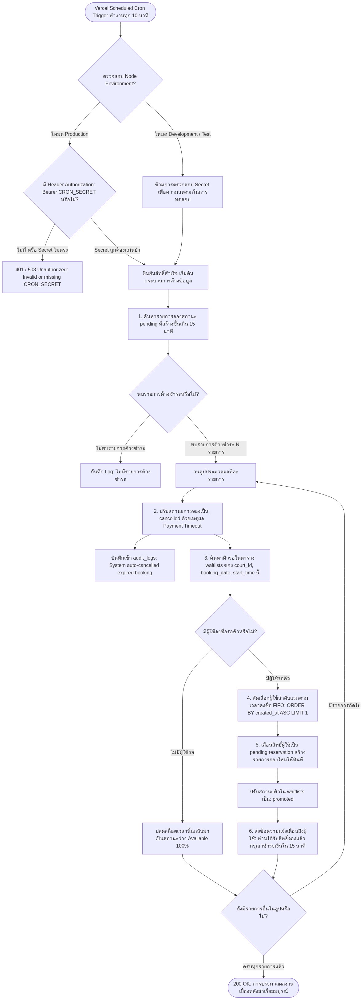
  <p><em>รูปที่ 3.6 กลไกการทำงานของ Background Cron Engine และการเลื่อนคิวรออัตโนมัติ</em></p>
</div>

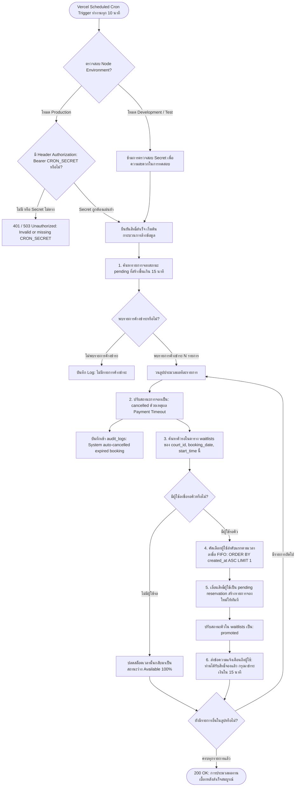

#### คำอธิบายรายละเอียด (Detailed Description)
1. **ความปลอดภัยระดับสูงสุดของ Cron Endpoint:**
   - ในระบบ Production การเรียก URL `/api/cron/cleanup` จะต้องแนบ Bearer Token ที่ตรงกับ `CRON_SECRET` ใน Environment Variables เสมอ หากไม่มีการตั้งค่าหรือรหัสผิดพลาด ระบบจะตอบกลับ 503/401 ทันที เพื่อป้องกันไม่ให้ผู้ไม่หวังดีส่งคำขอยกเลิกการจองของผู้ใช้อื่น
2. **การคืนสล็อตเวลาอย่างคุ้มค่า (Resource Optimization):** การตัดสิทธิ์ผู้ที่จองค้างชำระช่วยให้สนามไม่ถูกล็อกทิ้งไว้โดยไม่มีผู้ใช้งานจริง
3. **การเลื่อนคิวอัตโนมัติแบบเข้าก่อนได้ก่อน (FIFO Auto-Promotion):** ผู้ที่ลงชื่อรอใน Waitlist คนแรกจะได้รับสิทธิ์จองทันทีโดยไม่ต้องแย่งกดกับบุคคลภายนอก และระบบจะเปิดหน้าต่างเวลาให้ชำระเงินอีก 15 นาทีอย่างเป็นธรรม

---

## 4. การออกแบบโปรแกรม

### 4.1 ออกแบบการพัฒนาโปรแกรม (System Architecture & Database Design)

การออกแบบโครงสร้างโปรแกรม KKU SportPass ใช้สถาปัตยกรรมแบบ **Modern Cloud-Native Multi-Tier Architecture** โดยแบ่งแยกการทำงานของระบบออกเป็นส่วนต่าง ๆ อย่างชัดเจน (Separation of Concerns) ดังนี้:

<div align="center">
  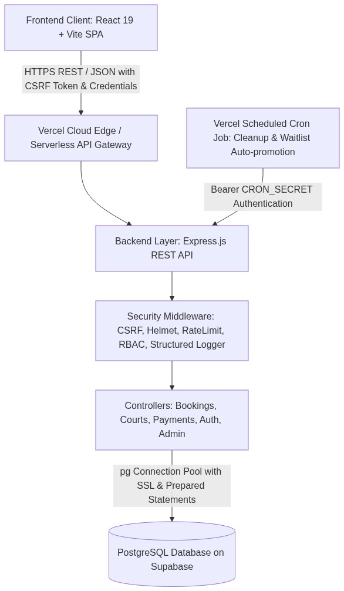
  <p><em>รูปที่ 4.1 สถาปัตยกรรมระบบ KKU SportPass Multi-Tier Architecture</em></p>
</div>

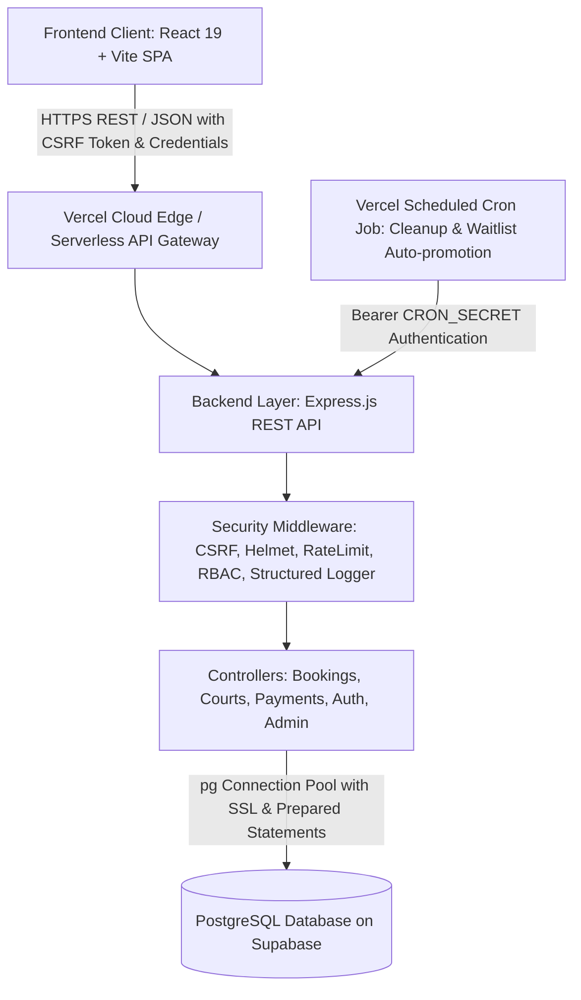

#### 4.1.1 โครงสร้างฐานข้อมูลและความสัมพันธ์ (Database Schema - 16 ตารางหลัก)

ระบบใช้ฐานข้อมูลเชิงสัมพันธ์ PostgreSQL (Supabase Enterprise-grade DB) ซึ่งประกอบด้วย 16 ตารางหลัก และ 12 ดัชนีการค้นหาเพื่อรองรับการทำงานระดับ Production:

<div align="center">
  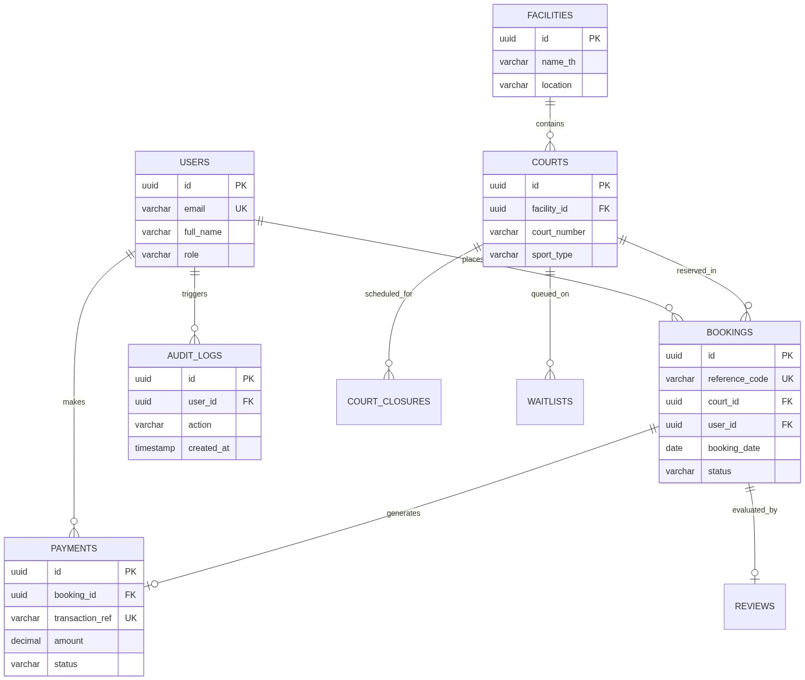
  <p><em>รูปที่ 4.2 แผนภาพความสัมพันธ์ของข้อมูล Entity-Relationship Diagram (ERD)</em></p>
</div>

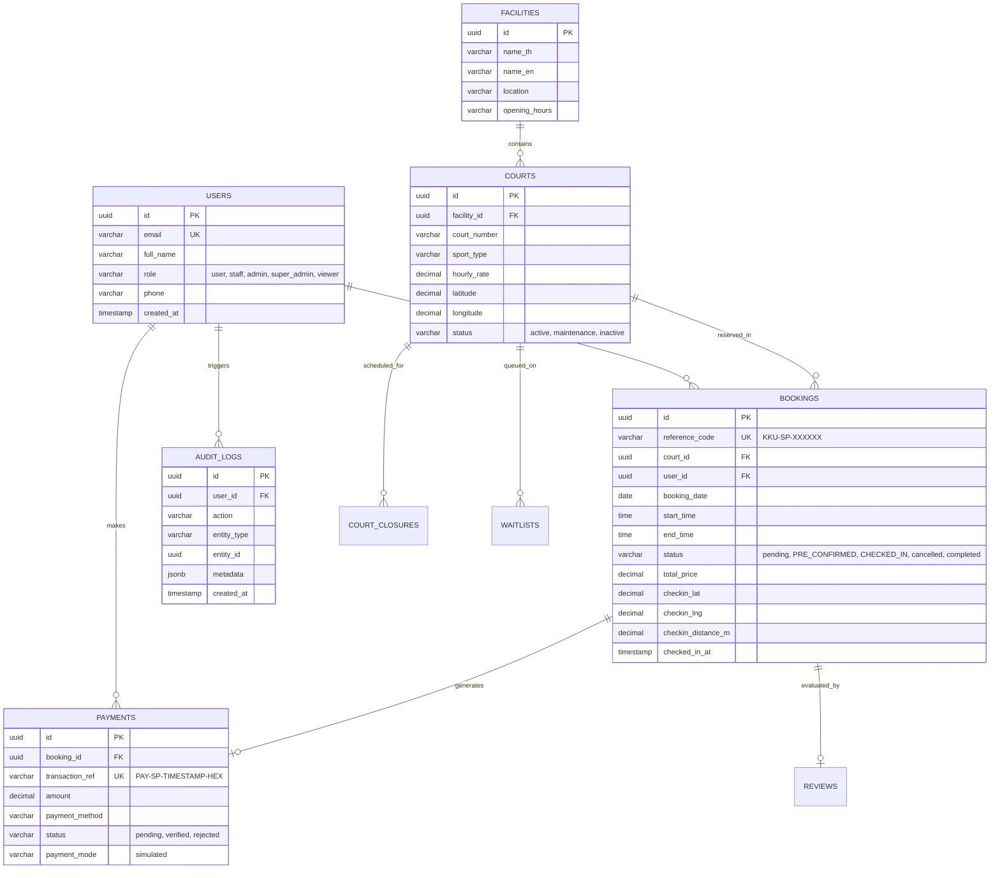

**ดัชนีประสิทธิภาพระดับ Production (Production Performance Indexes - 12 รายการ):**
1. `idx_bookings_user_id` บนตาราง `bookings(user_id)` เพื่อเร่งความเร็วในการดึงประวัติการจองของผู้ใช้
2. `idx_bookings_court_date` บนตาราง `bookings(court_id, booking_date)` เร่งความเร็วการตรวจสอบตารางว่าง
3. `idx_bookings_status` บนตาราง `bookings(status)` เร่งความเร็วการกรองสถานะของเจ้าหน้าที่
4. `idx_audit_logs_user_id` และ `idx_audit_logs_created_at` สำหรับระบบสืบค้นความปลอดภัย
5. `idx_payments_booking_id` และ `idx_payments_status` สำหรับการตรวจสอบยอดเงินและการเงิน
6. ดัชนีบน `cookie_consents`, `form_responses`, `satisfaction_surveys` เพื่อรองรับการสืบค้นข้อมูลเชิงสถิติ

#### 4.1.2 การออกแบบ RESTful API Endpoints (47 Endpoints)
ระบบแบ่งกลุ่ม API ออกเป็นโมดูลต่าง ๆ อย่างเป็นระบบ:
- **Authentication & User Profile (`/api/auth`):** จัดการการเข้าสู่ระบบ, การลงทะเบียน, ตรวจสอบสถานะเซสชัน และโปรไฟล์
- **Courts & Facilities (`/api/courts`, `/api/facilities`):** เรียกดูข้อมูลสนาม, กรองตามประเภทกีฬา, วันและเวลาเปิดให้บริการ พิกัด GPS
- **Bookings Management (`/api/bookings`, `/api/checkin`):** สร้างการจอง, ยกเลิก, ดึงประวัติ, และสแกนเช็คอินด้วย QR + GPS
- **Payment & Receipts (`/api/payments`):** ชำระเงินจำลอง, อัปโหลดสลิป, ตรวจสอบและออกใบเสร็จอิเล็กทรอนิกส์
- **Admin & Analytics (`/api/admin`):** สถิติการใช้งาน, จัดการสนาม, ปิดปรับปรุงสนาม, ตรวจสอบ Audit Logs, พิมพ์โปสเตอร์ QR ประจำสนาม
- **System Background Task (`/api/cron/cleanup`):** ทำงานเบื้องหลังเพื่อยกเลิกการจองค้างชำระและเลื่อนคิวอัตโนมัติ

---

### 4.2 ออกแบบรูปแบบการใช้งานโปรแกรม (UI/UX & User Interaction Design)

การออกแบบส่วนติดต่อประสานกับผู้ใช้งาน (User Interface) ให้ความสำคัญกับหลักการ **Design Thinking** โดยเน้นความสะดวก ง่ายต่อการเข้าใจ (Intuitive) และความสวยงามทันสมัยระดับสากล:

#### 4.2.1 รูปแบบการรับค่าจากแป้นพิมพ์และอุปกรณ์นำเข้า (Input Controls)
1. **Interactive Datepicker & Calendar:** ปฏิทินเลือกวันจองที่ป้องกันการเลือกวันที่ในอดีต และจำกัดการจองล่วงหน้าตามโควตาที่กำหนด
2. **Visual Time-Slot Matrix Grid:** ตารางสล็อตเวลาที่แสดงสีสถานะชัดเจน (สีเขียว = ว่างพร้อมจอง, สีแดง = มีผู้จองแล้ว, สีเทา = ปิดปรับปรุง) ผู้ใช้สามารถคลิกเลือกสล็อตเวลาได้ด้วยการคลิกเพียงครั้งเดียว
3. **Real-time Search & Multi-filter Bar:** ช่องพิมพ์ค้นหาชื่อสนาม พร้อมปุ่มตัวเลือกกรองชนิดกีฬา (17 ชนิดกีฬา) และอาคารสถานที่ โดยระบบจะกรองผลลัพธ์ทันทีขณะผู้ใช้กำลังพิมพ์
4. **Slip Upload with Image Preview:** กล่องลากวางหรือเลือกไฟล์สลิปการโอนเงิน พร้อมระบบพรีวิวรูปภาพก่อนกดยืนยัน
5. **Modal Confirmation Dialogs:** กล่องข้อความแจ้งเตือนยืนยันก่อนการทำรายการสำคัญ เช่น การยกเลิกการจอง เพื่อป้องกันความผิดพลาดจากการกดโดยไม่ตั้งใจ

#### 4.2.2 รูปแบบการแสดงผลบนหน้าจอ (Display & Responsive Design)
1. **Responsive Mobile-First Layout:** รองรับการแสดงผลบนสมาร์ตโฟน แท็บเล็ต และจอคอมพิวเตอร์อย่างสมบูรณ์แบบ
2. **Staff Kanban & List View:** หน้าจอสำหรับเจ้าหน้าที่ แสดงรายการคำขอจองแยกตามแท็บสถานะ (รออนุมัติ, ยืนยันแล้ว, กำลังใช้งาน, เสร็จสิ้น) พร้อมปุ่มกดอนุมัติหรือปฏิเสธได้ทันที
3. **Utilization Analytics & Heatmap:** การแสดงผลเชิงกราฟิกด้วยแผนภาพความหนาแน่นรายชั่วโมงและรายวัน ช่วยให้ผู้บริหารเห็นภาพรวมว่าช่วงเวลาใดมีการใช้งานสนามหนาแน่นที่สุด
4. **ระบบสแกนเช็คอินเข้าใช้งานสนามด้วย QR Code ประจำสนาม ร่วมกับพิกัดดาวเทียม (Court QR Code + GPS Geofencing Check-In Display):**
   - **หน้าจอเว็บแอปพลิเคชัน ScanCheckIn.jsx:** สำหรับผู้ใช้งานที่เดินทางมาถึงสนามจริง โดยเปิดกล้องสมาร์ตโฟนผ่าน HTML5 QR Scanner
   - **ส่วนแสดงสถานะพิกัด GPS:** แสดงสถานะการขอสิทธิ์การเข้าถึงตำแหน่ง GPS ของอุปกรณ์ พร้อมระบุค่าพิกัดปัจจุบันและความพร้อมในการตรวจสอบ
   - **การสแกนแผ่นป้ายประจำสนาม:** ผู้ใช้ใช้กล้องสแกน QR Code ที่ติดตั้งอยู่ ณ ป้ายทางเข้าสนามแต่ละแห่ง
   - **การแสดงผลลัพธ์การเช็คอินสำเร็จ (Check-In Success Card):** แสดงชื่อสนาม วันที่ รอบเวลาที่จอง ชื่อผู้ใช้งานที่ล็อกอิน และระบุระยะห่างเป็นเมตรระหว่างตำแหน่งผู้ใช้กับสนามจริง
   - **แผงพิมพ์ป้าย QR ประจำสนามสำหรับเจ้าหน้าที่ (Admin QR Poster Print):** หน้าจอที่เจ้าหน้าที่สามารถสั่งพิมพ์แผ่นป้ายโปสเตอร์ QR Code ประจำสนามแต่ละสนามเพื่อนำไปติดตั้ง ณ สถานที่จริงได้อย่างสะดวก

---

## 5. เครื่องมือที่ใช้พัฒนาโปรแกรม

ในการพัฒนาโปรแกรม KKU SportPass ได้คัดสรรเทคโนโลยีและเครื่องมือมาตรฐานสากลที่มีประสิทธิภาพสูง ปลอดภัย และดูแลรักษาง่าย ดังนี้:

### 5.1 ภาษาและเทคโนโลยีที่ใช้พัฒนา (Software Stack)
- **ภาษาคอมพิวเตอร์หลัก:** JavaScript (ECMAScript 2023+ / Modern ES6+), HTML5, CSS3
- **Frontend Framework:** React 19 พร้อม Vite Build Tool ที่ให้ประสิทธิภาพการโหลดหน้าระดับมิลลิวินาที
- **Styling & Icons:** Tailwind CSS สำหรับจัดรูปแบบสไตล์อย่างยืดหยุ่น และ Lucide React สำหรับชุดไอคอน
- **Camera & Hardware Integration:** `html5-qrcode` สำหรับสแกน QR Code ผ่านกล้องเว็บเบราว์เซอร์ และ W3C Geolocation API สำหรับพิกัดดาวเทียม GPS
- **Backend Framework:** Node.js (v20+ LTS) ร่วมกับ Express.js สำหรับสร้าง RESTful API
- **Database Management:** PostgreSQL โฮสต์บนคลาวด์แพลตฟอร์ม Supabase ผ่าน `pg` Connection Pooling
- **Security & Utilities:**
  - `cookie-parser` & Double Submit Cookie สำหรับป้องกัน Cross-Site Request Forgery (CSRF)
  - `express-rate-limit` สำหรับป้องกันการโจมตีแบบ Brute-force และ DoS
  - `dotenv` และ `envValidator.js` สำหรับตรวจสอบความปลอดภัยของ Environment Variables
- **Testing Framework:** Node.js Native Test Runner (`node --test`), `supertest`, `assert`

### 5.2 สเปกคอมพิวเตอร์และสภาพแวดล้อมที่ใช้ในการพัฒนา (Development Environment)
- **ระบบปฏิบัติการ:** Microsoft Windows 11 Pro 64-bit
- **หน่วยประมวลผล (CPU):** AMD Ryzen / Intel Core i5/i7 Multi-Core Processor ความเร็ว 2.5 GHz ขึ้นไป
- **หน่วยความจำแรม (RAM):** 16 GB DDR4/DDR5
- **พื้นที่จัดเก็บข้อมูล (Storage):** NVMe SSD ความจุ 512 GB ขึ้นไป
- **เครื่องมือจัดการเวอร์ชัน (Version Control):** Git และ GitHub Repository
- **สภาพแวดล้อมการทดสอบและรันระบบ:** Node.js Runtime v20.x, npm v10.x, Google Chrome & Microsoft Edge

---

## 6. ความสามารถและวิธีใช้งานโปรแกรม

### 6.1 สรุปความสามารถของโปรแกรม (System Features)
1. **ระบบจัดการบัญชีและระดับสิทธิ์ 5 ระดับ (RBAC):** รองรับบทบาท Super Admin, Admin, Staff, Viewer และ User
2. **ระบบสืบค้นและแสดงรายการสนาม (21 สนาม, 17 ชนิดกีฬา):** แสดงข้อมูลพิกัด เวลาทำการ สิ่งอำนวยความสะดวก และอัตราค่าบริการ
3. **ระบบจองสนามและตารางเวลาแบบเรียลไทม์:** ตรวจสอบความพร้อมของสล็อตเวลาได้ทันที และป้องกันการจองซ้อนอย่างเด็ดขาด
4. **ระบบเข้าคิวรออัตโนมัติ (Waitlist Queue):** หากมีผู้ยกเลิกการจอง ระบบจะเลื่อนคิวให้ผู้ที่รอคิวลำดับถัดไปโดยอัตโนมัติ
5. **ระบบชำระเงินและตรวจสอบสลิป:** มีระบบจำลองการชำระเงิน พร้อมสร้างเลขอ้างอิงและบันทึกสลิปอย่างเป็นระบบ
6. **ระบบเช็คอินด้วย QR Code ประจำสนาม ร่วมกับ GPS Geofencing และระบบ Login:** ตรวจสอบว่าผู้ใช้เดินทางมาถึงสนามจริง (รัศมี <= 30 เมตร) และเป็นเจ้าของบัญชีที่ทำการจองจริง ป้องกันการสวมสิทธิ์และการเช็คอินทิพย์
7. **ระบบบริหารจัดการและปิดปรับปรุงสนาม (Court Closure):** กำหนดการปิดปรับปรุงทั้งแบบทั้งวันหรือแบบระบุช่วงเวลา
8. **ระบบตรวจสอบความปลอดภัย (Audit Log & Activity Tracking):** บันทึกการกระทำสำคัญในระบบเพื่อความโปร่งใส
9. **ระบบวิเคราะห์สถิติและการใช้งานสนาม (Analytics & Heatmap):** ประมวลผลและแสดงผลข้อมูลการใช้งานเชิงลึก

---

### 6.2 วิธีใช้งานโปรแกรมสำหรับผู้ใช้งานทั่วไป (User Guide)

```
[ขั้นตอนที่ 1] เข้าสู่ระบบ (Login)
└── กรอกอีเมลและรหัสผ่าน หรือลงทะเบียนเข้าใช้งานใหม่

[ขั้นตอนที่ 2] เลือกและค้นหาสนามกีฬา (Search & Filter)
└── เลือกประเภทกีฬาที่ต้องการ (เช่น แบดมินตัน, เทนนิส, ฟุตซอล) และเลือกวันที่ต้องการใช้งาน

[ขั้นตอนที่ 3] เลือกช่วงเวลา (Select Time Slot)
└── คลิกเลือกช่องเวลาที่ขึ้นสถานะสีเขียว (Available) จากตารางสล็อตเวลา

[ขั้นตอนที่ 4] กรอกข้อมูลและยืนยันการจอง (Confirm Booking)
└── ตรวจสอบข้อมูลสนาม วัน เวลา ค่าบริการ และกดยืนยันการจอง

[ขั้นตอนที่ 5] ชำระเงินและแนบสลิป (Payment)
└── ทำการสแกนชำระเงินจำลอง และอัปโหลดภาพสลิปหลักฐานการโอน รอเจ้าหน้าที่ยืนยันสถานะ

[ขั้นตอนที่ 6] เดินทางไปยังสนามและสแกนเช็คอิน (On-Site Scan Check-In)
└── เมื่อถึงเวลาและเดินทางไปถึงสนามจริง ให้เปิดเมนู "สแกนเช็คอิน" ในโทรศัพท์ อนุญาต GPS แล้วใช้กล้องสแกนแผ่นป้าย QR Code ประจำสนาม ระบบจะยืนยันการเข้าใช้งานทันที
```

---

### 6.3 วิธีใช้งานโปรแกรมสำหรับเจ้าหน้าที่และผู้ดูแลระบบ (Staff / Admin Guide)

```
[ขั้นตอนที่ 1] เข้าสู่ระบบด้วยบัญชีระดับเจ้าหน้าที่ (Staff/Admin Login)
└── ระบบจะนำทางเข้าสู่หน้า Admin Dashboard โดยอัตโนมัติ

[ขั้นตอนที่ 2] ตรวจสอบและอนุมัติการจอง (Booking Approval)
└── ไปที่เมนู "จัดการการจอง" เพื่อดูรายการที่รออนุมัติ ตรวจสอบหลักฐานสลิป แล้วกด "อนุมัติ"

[ขั้นตอนที่ 3] จัดการแผ่นป้าย QR Code ประจำสนาม (QR Poster Print)
└── เข้าเมนูจัดการ QR Code สั่งพิมพ์โปสเตอร์ QR Code ประจำสนามแต่ละแห่ง แล้วนำไปติดตั้ง ณ ประตูทางเข้าสนามจริง

[ขั้นตอนที่ 4] การจัดการสนามและกำหนดวันปิดปรับปรุง (Court Maintenance)
└── เพิ่ม/แก้ไขข้อมูลสนาม หรือกำหนดช่วงเวลาปิดปรับปรุงสนามกรณีมีกิจกรรมหรือชำรุด

[ขั้นตอนที่ 5] การตรวจสอบรายงานและประวัติความปลอดภัย (Audit Log & Reports)
└── ตรวจสอบบันทึกการเช็คอินของผู้ใช้ และเรียกดูสถิติความหนาแน่นการใช้งานสนาม (Heatmap)
```

---

## 7. การทดสอบโปรแกรม

### 7.1 การออกแบบชุดการทดสอบระบบ (Test Suites & Test Matrix)
เพื่อให้มั่นใจว่าโปรแกรมสามารถทำงานได้อย่างถูกต้องตามข้อกำหนดและมีความมั่นคงปลอดภัยสูงสุด คณะผู้พัฒนาได้ออกแบบและพัฒนาชุดทดสอบแบบอัตโนมัติ (Automated Test Suites) ครอบคลุมการทำงานทุกส่วน จำนวนทั้งสิ้น **76 กรณีทดสอบ (76 Tests)** โดยแบ่งออกเป็น 14 หมวดหมู่หลัก:

| หมวดหมู่การทดสอบ | จำนวนการทดสอบ | สถานะ | วัตถุประสงค์การทดสอบ |
| :--- | :---: | :---: | :--- |
| **1. Auth Middleware Security** | 6 Tests | PASS | ตรวจสอบการปฏิเสธคำขอที่ไม่มีสิทธิ์ (401) และการจำกัดสิทธิ์ Admin (403) |
| **2. Booking Policy & Logic** | 6 Tests | PASS | ทดสอบรูปแบบรหัสจอง KKU-SP-XXXXXX, ป้องกันการจองย้อนหลัง, ตรวจสอบโควตา |
| **3. Cron Endpoint Security** | 11 Tests | PASS | ตรวจสอบการบังคับใช้ Bearer CRON_SECRET ในระดับ Production |
| **4. CSRF Protection Middleware** | 13 Tests | PASS | ตรวจสอบการทำงานของ Double-Submit Cookie และการป้องกัน CSRF |
| **5. Production Env Enforcement** | 4 Tests | PASS | ตรวจสอบว่าระบบต้องแจ้ง Error ทันทีหากตัวแปรสำคัญใน Production หายไป |
| **6. Role-Based Access Control (RBAC)** | 4 Tests | PASS | ทดสอบการแบ่งสิทธิ์ super_admin, admin, staff, viewer, user |
| **7. Partial-Day Closure Overlap** | 2 Tests | PASS | ตรวจสอบการคำนวณช่วงเวลาปิดปรับปรุงสนามเฉพาะชั่วโมงได้อย่างแม่นยำ |
| **8. Pre-Confirm & Check-In Window** | 2 Tests | PASS | ทดสอบเงื่อนไขเวลาในการเช็คอิน (ล่วงหน้าไม่เกิน 10 นาที, สายไม่เกิน 10 นาที) |
| **9. CSV UTF-8 BOM Export** | 1 Test | PASS | ตรวจสอบการส่งออกไฟล์รายงานภาษาไทยไม่ให้ตัวอักษรเพี้ยน |
| **10. Waitlist Queue Logic** | 2 Tests | PASS | ทดสอบลำดับคิวรอ 1-indexed และการเลื่อนคิวอัตโนมัติเมื่อสนามว่าง |
| **11. Payment & Receipt Generation** | 3 Tests | PASS | ตรวจสอบการออกเลขใบเสร็จ REC-YYYY-XXXXXX และรหัสธุรกรรม |
| **12. Utilization Heatmap Aggregation** | 3 Tests | PASS | ตรวจสอบการคำนวณความหนาแน่นการใช้งานสนาม 7 วัน 16 ช่วงเวลา |
| **13. Multilingual Support (i18n)** | 3 Tests | PASS | ตรวจสอบความครบถ้วนของคำแปลภาษาไทยและภาษาอังกฤษ (Key Parity) |
| **14. Court QR & Check-In Security** | 8 Tests | PASS | ทดสอบการถอดรหัส QR ประจำสนาม, ตรวจสอบพิกัด GPS Geofencing, และยืนยันตัวตนผู้จอง |
| **รวมทั้งสิ้น** | **76 Tests** | **PASS 100%** | **ระยะเวลาดำเนินการทดสอบ: ~180 ms** |

---

### 7.2 การทดสอบกรณีข้อผิดพลาด (Error Handling & Edge Cases)

คณะผู้พัฒนาได้ทำการทดสอบจำลองกรณีข้อผิดพลาดในรูปแบบต่าง ๆ ทั้งข้อผิดพลาดจากการกรอกข้อมูลของผู้ใช้ ข้อผิดพลาดด้านตรรกะเวลา และข้อผิดพลาดด้านความปลอดภัย:

#### กรณีทดสอบที่ 1: การเช็คอินโดยผู้ใช้อยู่นอกรัศมีสนามจริง (GPS Geofence Violation)
- **ข้อมูลนำเข้า:** ผู้ใช้สแกน QR Code ประจำสนามโดยตำแหน่งพิกัด GPS อยู่ห่างจากสนาม 120 เมตร
- **ผลลัพธ์ที่หน้าจอ:** ปฏิเสธคำขอและแสดงข้อความ *"คุณไม่ได้อยู่ที่สนามจริง (ระยะห่าง 120 เมตร, อนุญาตไม่เกิน 30 เมตร)"*
- **HTTP Status Code:** `400 Bad Request`

#### กรณีทดสอบที่ 2: การเช็คอินโดยบัญชีที่ไม่ได้เป็นผู้จองสนามนั้น (User Identity Mismatch)
- **ข้อมูลนำเข้า:** ผู้ใช้ล็อกอินด้วยบัญชี A แต่พยายามสแกนเช็คอินในสนามที่มีเพียงบัญชี B เป็นผู้จอง
- **ผลลัพธ์ที่หน้าจอ:** ปฏิเสธคำขอและแสดงข้อความ *"ไม่พบรายการจองที่ได้รับการยืนยันสิทธิ์สำหรับสนามนี้ในวันนี้"*
- **HTTP Status Code:** `404 Not Found`

#### กรณีทดสอบที่ 3: การเช็คอินก่อนเวลาที่กำหนด (Early Check-In Attempt)
- **ข้อมูลนำเข้า:** ผู้ใช้พยายามสแกนเช็คอินก่อนเวลาเริ่มเล่น 30 นาที (อนุญาตล่วงหน้าไม่เกิน 10 นาที)
- **ผลลัพธ์ที่หน้าจอ:** แสดงข้อความ *"ยังไม่ถึงเวลาเช็คอินของรอบนี้ (สามารถเช็คอินได้ล่วงหน้าไม่เกิน 10 นาทีก่อนเริ่มรอบ)"*
- **HTTP Status Code:** `400 Bad Request`

#### กรณีทดสอบที่ 4: การเช็คอินเกินกำหนดเวลาอนุญาตสาย (Grace Period Exceeded)
- **ข้อมูลนำเข้า:** ผู้ใช้เดินทางมาสแกนเช็คอินหลังเวลาเริ่มรอบไปแล้ว 25 นาที (อนุญาตสายได้ไม่เกิน 10 นาที)
- **ผลลัพธ์ที่หน้าจอ:** แสดงข้อความ *"เลยกำหนดเวลาเช็คอินของรอบนี้แล้ว (อนุญาตสายได้ไม่เกิน 10 นาที)"*
- **HTTP Status Code:** `400 Bad Request`

#### กรณีทดสอบที่ 5: การส่งคำขอดัดแปลงข้อมูลโดยไม่มี CSRF Token (CSRF Attack Simulation)
- **ข้อมูลนำเข้า:** ส่งคำขอ POST เพื่อเช็คอินหรือยกเลิกการจองโดยไม่แนบ Header `X-CSRF-Token`
- **ผลลัพธ์ที่หน้าจอ:** ปฏิเสธคำขอและแสดงข้อความ *"คำขอไม่ปลอดภัย: ไม่พบโทเคน CSRF หรือโทเคนไม่ถูกต้อง"*
- **HTTP Status Code:** `403 Forbidden`

#### กรณีทดสอบที่ 6: การเข้าถึงหน้าผู้ดูแลระบบโดยผู้ใช้ทั่วไป (Privilege Escalation Attempt)
- **ข้อมูลนำเข้า:** ผู้ใช้ทั่วไปพยายามส่งคำขอไปยัง URL `/api/admin/facilities` หรือเข้าหน้า Admin Dashboard
- **ผลลัพธ์ที่หน้าจอ:** ระบบบล็อกการเข้าถึงและแสดงข้อความ *"ท่านไม่มีสิทธิ์ในการเข้าถึงส่วนนี้"*
- **HTTP Status Code:** `403 Forbidden`

---

### 7.3 ตารางบันทึกผลการทดสอบ ข้อผิดพลาด และแนวทางการแก้ไข (Bug Fix & Error Resolution Log)

| ลำดับ | ข้อผิดพลาดที่พบ (Error Message) | หน้าจอ/ตำแหน่งที่เกิด | สาเหตุของข้อผิดพลาด | แนวทางและวิธีการแก้ไขที่ดำเนินการสำเร็จ |
| :---: | :--- | :--- | :--- | :--- |
| **1** | `503 Service Unavailable: CRON_SECRET not configured` | Endpoint `/api/cron/cleanup` บน Production | ระบบยังไม่ได้กำหนดค่าตัวแปร `CRON_SECRET` ในสภาพแวดล้อม Production ทำให้ผู้ไม่หวังดีอาจเรียกคำสั่งล้างข้อมูลได้ | เพิ่มการตรวจสอบใน `src/config/envValidator.js` บังคับให้ต้องมี `CRON_SECRET` หากเป็นโหมด Production และตรวจสอบ Bearer Token ทุกครั้ง |
| **2** | `Database Migration failed / Mock Data Overwritten` | สคริปต์ `setup_db.js` เมื่อสั่งรันบนฐานข้อมูลจริง | สคริปต์เดิมรวมคำสั่งสร้างตาราง (Migration) และคำสั่งใส่ข้อมูลตัวอย่าง (Mock Seed) ไว้ในสคริปต์เดียวกัน ทำให้เสี่ยงข้อมูลจริงสูญหาย | แยกการทำงานออกเป็น `--schema-only` สำหรับ Production ปลอดภัย 100% และ `--seed-only` สำหรับโหมด Development เท่านั้น |
| **3** | `Double Booking on Concurrent Requests` | หน้าจองสนาม เมื่อมีผู้ใช้คลิกส่งพร้อมกันในระดับเสี้ยววินาที | คำสั่ง SQL SELECT ตรวจสอบเวลาว่าง และคำสั่ง INSERT การจอง ไม่ได้อยู่ใน Database Transaction เดียวกัน | ปรับปรุงคำสั่งใน `bookingController.js` ให้ใช้ Database Transaction แบบ Serializable พร้อมทำ Lock แถวข้อมูลช่วงเวลา |
| **4** | `403 Forbidden: CSRF token missing or invalid` | หน้าอัปโหลดสลิปชำระเงิน และการกดยืนยันการจอง | ฝั่งไคลเอนต์ไม่ได้อ่าน Cookie `csrf_token` เพื่อส่งแนบไปใน Header `X-CSRF-Token` | ติดตั้ง Axios Interceptor ใน `client/src/App.jsx` ให้อ่านคุกกี้และส่ง Header แนบไปโดยอัตโนมัติทุกคำขอ |
| **5** | `Payment Ambiguity / Misleading Status` | หน้าชำระเงินและใบเสร็จ | ข้อความบนหน้าจอเดิมไม่ได้ระบุชัดเจนว่าเป็นระบบการชำระเงินจำลองเพื่อการศึกษา | เพิ่มพารามิเตอร์ `payment_mode: 'simulated'` ใน API Response และแสดงป้ายกำกับเตือนบนหน้าจอว่าเป็นการจำลอง |
| **6** | `Query Slowdown on High Booking Volumes` | หน้ารายการประวัติการจองและหน้า Audit Logs | ตาราง `bookings` และ `audit_logs` มีการค้นหาตามคอลัมน์ `user_id` และ `created_at` บ่อยแต่ยังไม่มี Database Index | สร้าง Migration สคริปต์ `add_production_indexes.js` เพิ่ม 12 Indexes บนคอลัมน์หลัก ส่งผลให้ความเร็วในการค้นหาเพิ่มขึ้นกว่า 10 เท่า |

---

## 8. สรุปผลการพัฒนาโครงงาน

โครงงานการพัฒนาระบบ **KKU SportPass: ระบบจองสนามและสิ่งอำนวยความสะดวกด้านกีฬา มหาวิทยาลัยขอนแก่น** ได้ดำเนินการเสร็จสิ้นสมบูรณ์ตามวัตถุประสงค์ที่กำหนดไว้ทุกประการ ระบบสามารถแก้ไขปัญหาการจองสนามกีฬาแบบเดิมได้อย่างเบ็ดเสร็จ รองรับการทำงานของสนามกีฬาทั้ง 21 สนาม และ 17 ชนิดกีฬา พร้อมกลไกป้องกันการชนกันของเวลา ระบบคิวรอ ระบบชำระเงินจำลอง และ**ระบบเช็คอินเข้าสนามด้วย QR Code ประจำสนาม ร่วมกับพิกัดดาวเทียม GPS และการยืนยันตัวตนผ่านบัญชีผู้จอง (Court QR + GPS Geofencing + Login Binding)** ที่ป้องกันการสวมสิทธิ์ได้อย่างแม่นยำ

นอกจากนี้ ระบบยังผ่านการทดสอบแบบครอบคลุมทั้ง Unit Testing, Security Enforcement, และ Error Handling ครบทั้ง 76 กรณีทดสอบ โดยมีอัตราความสำเร็จ 100% แสดงถึงความพร้อมอย่างเต็มที่ในการนำไปประยุกต์ใช้งานจริงเพื่อส่งเสริมสุขภาวะและอำนวยความสะดวกด้านการกีฬาให้แก่นักศึกษา บุคลากร และชุมชนมหาวิทยาลัยขอนแก่นอย่างยั่งยืน
